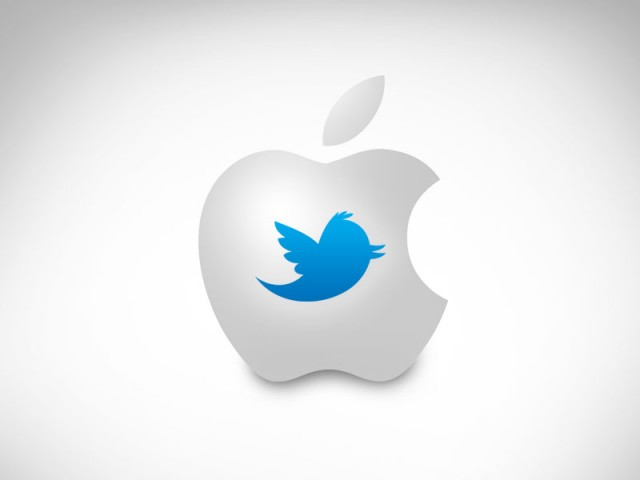

# Twitter NLP Modeling: Identifying Consumer Sentiment Towards Apple  

__________________________________________________________________________________________________________________ 

**Authors:** [Brandon Menendez](https://www.linkedin.com/in/brandon-menendez/) & [Nazar Mohl](https://www.linkedin.com/in/nazar-mohl/)
---  

## Overview
__________________________________________________________________________________________________________________
This project analyzes data gathered from [Twitter via CrowdFlower](https://data.world/crowdflower/brands-and-product-emotions). The dataset contains tweets from the 2011 South by Southwest(SXSW) festival, and captures tweets about Apple, Google, and/or their products. We aim to help Apple's product team get a better sense of how consumers are reacting to their brand and products, so they can better identify groups for targeted ad campaigns on Twitter. To do so, we apply multiple machine learning models to help classify the sentiment of each tweet as either Neutral, Positive, or Negative. For the purposes of this project, we are only trying to distinguish the Neutral tweets from the Positive or Negative tweets (more info below).  

Overall, we were able to produce a Multinomial Naive Bayes model that had 63% precision and 69% recall in predicting tweet sentiment.  

---  
## Business understanding  

Stakeholder: Apple Social Media Advertising Team.  
Business Problem: Develop model that analyzes the sentiment of tweets and identify appropriate users for targeted ads.  

Our preliminary understanding of the data (which we will expound on below) was that tweets were evaluated by contributors and assigned to categories of 'positive', 'negative' and 'neutral'. In the required directive to advise Apple on how to optimally increase sales, We assert that Apple's marketing budget does not need primarily to be focused on those users who already have a positive image of Apple. They have already committed their dollars to Apple and one can presume that they continue to be willing to spend on Apple products and services. Those with negative dispositions may, perhaps, be persuaded to adjust their thinking but we expect that this will require more effort and expense. Users who have expressed a neutral view or no view at all are more likely to be persuaded to spend on Apple.

Therefore, we have chosen a strategy of segregating neutral users from those with decided opinions whether positive or negative. The "neutral" users are the "low hanging fruit" that Apple should target. Apple is more likely to convert these users at lower cost than to pursue the decidedly negative users.

---  
## Data understanding  

The dataset used for this project was scraped by Crowdflower on August 30, 2013 and comes from data.world. The original dataset contained 9,093 tweets pertaining to both Apple and Google's presentations at the 2011 SXSW conference. After removing null tweets and restricting the dataframe to only tweets that reference Apple, we were left with around 5.2K tweets ahead of modeling.  

The original tweets in the dataset were augmented by a separately generated rating value which indicated positive, negative, or no emotion towards a brand and/or product. Some of the tweets were also mapped to a brand, product or service.

Preliminary data exploration revealed that some of the ratings were clearly wrong but were apparently based upon certain keywords that taken out of context could be seen to indicate the assigned rating. This point needs to be understood because it is not practical to clean all of these errors and that these errors will always impact the viability of the final model.

---
## Data Preparation  

### Record/Data Removal
Of the original 9K+ records, null records were initially removed. Only records pertaining to Apple or Apple products or services were needed for this analysis. So, all other records were removed. This left about 5.2K records with which to build the required models.

All noisy characters and words were removed such as:
- Non-ASCII, most punctuation, standalone single characters
- Irrelevant or common words that do not contribute to the analysis of sentiment (articles, pronouns, prepositions, etc.)
- @mentions, links/URLs

Hashtags were discussed and, ultimately, retained because they can contribute to the mood/sentiment of the tweet or otherwise highlight a product or brand.  

---
## Data Analysis  

### New feature  
Per the "Business understanding" discussion above, ratings were reduced to just two values: Neutral; Non-neutral (the aggregate of positive and negative).  

### Retweet analysis  
Retweets were examined. Almost a third of the tweets in the dataset appeared to be retweets. The same tweet multiplied by retweeting would, on the one hand, overemphasize that one tweet. However, the multiple retweets do provide information on the overall sentiment that is being expressed by that tweet. The tweets lacked certain critical information to analyze this area further. The account that generated the tweet was not included with the data nor the date/time of the tweet. Analysis on how quickly a tweet could be spread, who initiated it, whether some 'influencer' caused the tweet to go viral, etc. can only be done with additional information.  

### Emoji analysis  
Emojis can have a strong influence on the expression or emphasis of sentiment. Unfortunately, in the dataset that was provided, there were very few emojis and not enough to create any impact on the model. Emojis were removed along with other noisy characters.  

### Calculations  
Frequency/distribution of words was calculated and charted (als0 used to create a word cloud for the presentation).  

Emphasis is indicated on social media by capital letters. To investigate any potential insight, the ratio of capital to lowercase letters was calculated. Similarly, a count of “!” and “?” characters was used to see if any insight could be gleaned towards sentiment.  

---
## Modeling Process / Evaluation metrics  

The following models were applied:
- Decision Tree  
- Multinomial Naive Bayes  

The following metrics were used:  
- **Recall** (Emphasize False Negatives) tells us to what extent target users identified as not neutral are actually neutral.  

- **Precision** (False Positives) tells us to what extent target users identified as neutral are actually not neutral.  

---
## Conclusions  

The optimal model per these metrics was the **Multinomial Naive Bayes** because it produced the best balance of precision and recall with the following results:  
- Recall = 69% and  
- Precision = 63%  

This means that using this model:
- 69% of target customers (neutral tweeters) can be correctly identified  
- 63% of budget is correctly applied

---
## Recommendation  
  
We recommend that Apple should use this model to inform targeted ad campaigns using twitter.

---
## Next Steps  

We recommend 3 different areas in which to:
- Acquire more data on retweets such as the sender account and timestamp and analyze the impact of retweets on sentiment as well as identify individual users whose tweets have greater impact in the target community.
- Acquire a larger set of tweets so as to include more emojis and analyze their impact on sentiment.  
- Acquire a larger set of tweets so as to include more references to individual products/services and analyze Sentiments to these products or services.  

## Project Artifacts  
See our GitHub repository [here](https://github.com/brandmend/nlp_twitter_modeling)  

### Project Structure  
```bash
├──.gitignore
├──Presentation.pdf
├──README.md
├──NLP_Twitter_Modeling_Project.ipynb
├──data
   ├──Original CSV files
├──images
   ├──Charts and graphics used in README file.

```